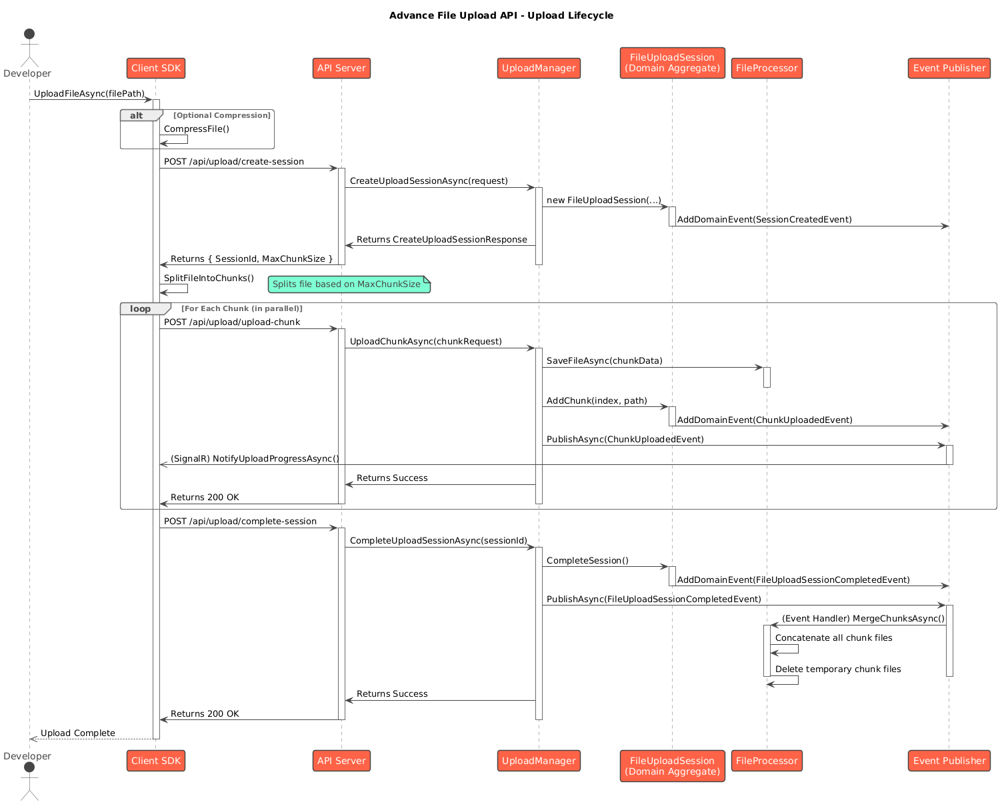

# **File Upload Lifecycle**

This article provides a detailed sequence diagram illustrating the interactions between the system's components during a large file upload. The diagram shows the flow of control from the client SDK to the server's internal services.

## **File Upload Sequence Diagram**

## **Explanation of the Diagram**

1. **Initiation**: The process starts when a developer calls UploadFileAsync on the **Client SDK**.  
2. **Session Creation**:  
   * The SDK sends a POST request to the /api/upload/create-session endpoint on the **API Server**.  
   * The server's UploadManager service handles this request. It creates a new FileUploadSession domain aggregate, which represents the state of the upload.  
   * The server responds with a unique SessionId and the configured MaxChunkSize.  
3. **Chunking**: The SDK uses the MaxChunkSize to split the local file into multiple parts.  
4. **Parallel Chunk Upload Loop**:  
   * The SDK iterates through the chunks and uploads them in parallel.  
   * For each chunk, it sends a POST request to /api/upload/upload-chunk.  
   * The UploadManager calls the FileProcessor to save the chunk's data to a temporary file.  
   * It then updates the FileUploadSession aggregate by calling the AddChunk method.  
   * The FileUploadSession raises a ChunkUploadedEvent. The Event Publisher (via MediatR) dispatches this event.  
   * An event handler for ChunkUploadedEvent triggers a real-time progress update back to the client via a SignalR hub.  
5. **Completion Request**:  
   * After all chunks are successfully uploaded, the SDK sends a final POST request to /api/upload/complete-session.  
   * The UploadManager finds the corresponding session and calls its CompleteSession() method.  
6. **Merging and Cleanup**:  
   * Calling CompleteSession() raises a FileUploadSessionCompletedEvent.  
   * A dedicated event handler listens for this event and invokes the FileProcessor to perform the MergeChunksAsync operation.  
   * The FileProcessor reads all the temporary chunk files, concatenates them into the final file, and then deletes the temporary files.  
7. **Final Acknowledgement**: The server returns a success status to the SDK, which in turn signals completion to the developer's code.