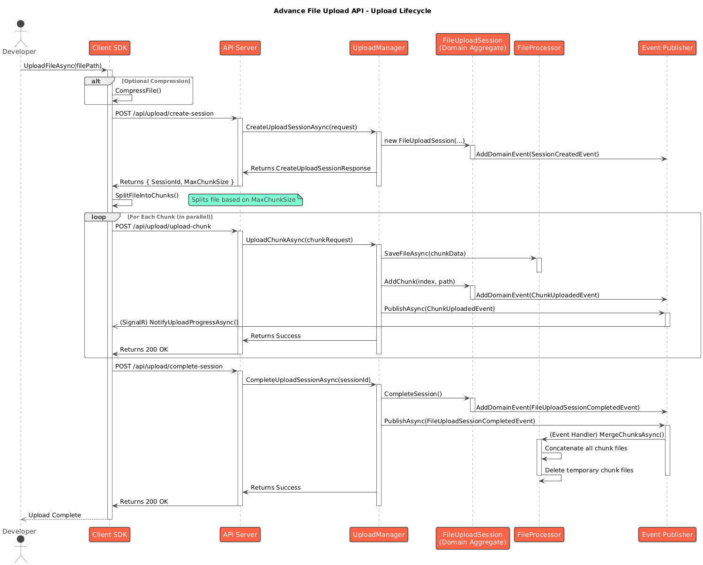

# **Understanding the File Upload Process**

This document explains the end-to-end lifecycle of a file upload within the system, from the initial client request to the final file assembly on the server.

The process is a coordinated effort between the client SDK and the server-side API, involving session management, chunking, and merging.

## **File Upload Lifecycle**

____
1. **Initiation (Client SDK)**  
   * A developer using the client SDK calls `fileUploadService.UploadFileAsync("path/to/file")`.  
   * If compression is enabled and applicable, the SDK first compresses the file into a temporary location.  
2. **Session Creation**  
   * The client SDK sends a request to the server's `/api/upload/create-session` endpoint.  
   * The request payload includes metadata like the original filename, file size, and (if applicable) compressed file size.  
   * The server's UploadManager validates the request (e.g., checks file size and extension against configured limits).  
   * If valid, a new FileUploadSession entity is created in the database with a status of InProgress.  
   * The server responds with a unique SessionId and the configured MaxChunkSize.  
3. **File Chunking (Client SDK)**  
   * Using the MaxChunkSize from the server, the client SDK reads the source file (or the compressed temporary file) and splits it into smaller, sequentially numbered chunks.  
4. **Chunk Upload**  
   * The client SDK begins uploading the chunks to the server in parallel, up to the configured MaxConcurrentUploads limit.  
   * Each chunk is sent as a separate POST request to the `/api/upload/upload-chunk` endpoint. The payload includes the SessionId, the chunk's index, and the binary data of the chunk.  
   * For each request, the server's UploadManager validates the chunk.  
   * The binary data is saved as a temporary file on the server (e.g., `{SessionId}_{ChunkIndex}.chunk`).  
   * The FileUploadSession entity is updated to record that the chunk has been received.  
   * A ChunkUploadedEvent is raised, triggering a real-time progress update to be sent to the client via SignalR.  
5. **Resumability and Retries**  
   * If a chunk upload fails due to a network error, the client SDK's Polly retry policy will automatically re-send the chunk after a short delay.  
   * If the entire upload process is interrupted (e.g., browser closed), the user can call ResumeUploadAsync. The SDK will query the server for the session status, determine which chunks are missing, and upload only those.  
6. **Finalization**  
   * Once the client SDK has successfully uploaded all chunks, it sends a final request to the /api/upload/complete-session endpoint with the SessionId.  
   * The server's UploadManager verifies that all expected chunks for the session have been received.  
   * The FileUploadSession's status is updated to Completed.  
   * A FileUploadSessionCompletedEvent is raised.  
7. **File Merging and Cleanup**  
   * The FileUploadSessionCompletedEvent triggers a handler that begins the final assembly process.  
   * The FileProcessor reads all the temporary chunk files from disk in the correct order.  
   * It concatenates them into a single, final file in the configured SavingDirectory.  
   * If the file was compressed, it is decompressed after merging.  
   * Once the final file is successfully created, all the temporary chunk files for the session are deleted.  
8. **Completion Notification**  
   * An optional SessionCompletedIntegrationEvent can be published to a RabbitMQ message bus, notifying external systems that a new file is ready for processing.
_____

## **Upload Session State Transitions**

_____
The FileUploadSession is managed by a state machine that governs its lifecycle. Understanding these states is key to understanding how the API handles different scenarios like pausing, resuming, and failures.

**InProgress**: This is the default state after a session is created. In this state, the server is actively accepting chunk uploads from the client.

**Paused**: The client can explicitly move the session to this state by calling PauseUploadAsync(). No chunks will be accepted, but the session's temporary data is preserved on the server, ready to be resumed.

**PendingToComplete**: The session automatically transitions to this state once the server has received the final expected chunk. It signifies that the server is now waiting for the client to send the final complete-session request to finalize the file.

**Completed**: A terminal state indicating that the client has confirmed completion, and the server has successfully merged all chunks into the final file. The temporary data has been cleaned up.

**Canceled**: A terminal state reached when the client explicitly cancels the upload. All temporary chunk files associated with the session are deleted.

**Failed**: A terminal state indicating that the upload could not be completed. This can happen if the session is abandoned for an extended period (e.g., > 48 hours) and is cleaned up by a background service, or if an unrecoverable error occurs during the merging process.